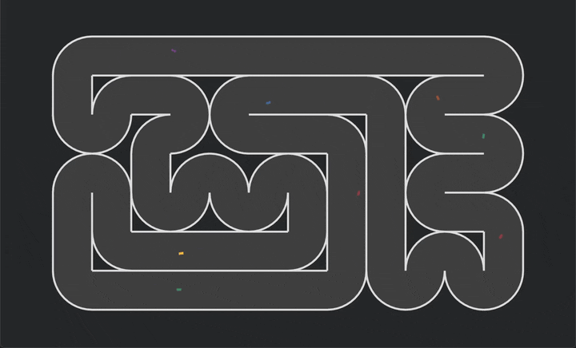
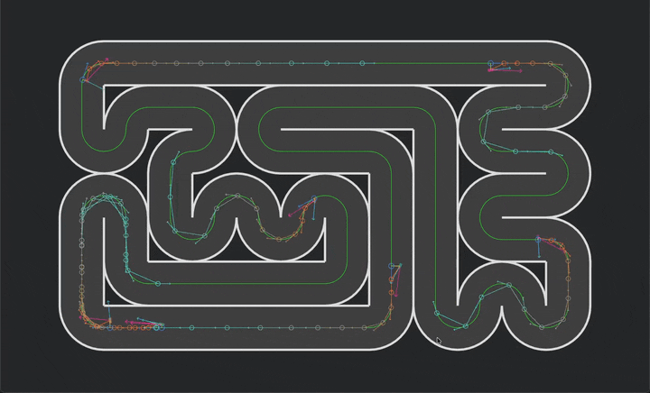
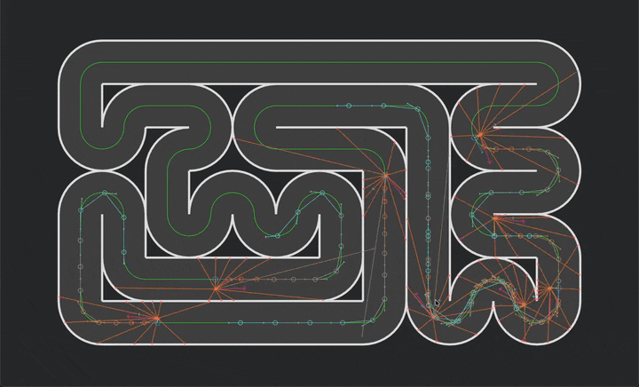

# NeuroDrive

<p align="center">
  
</p>

## Project Description

**NeuroDrive** is a real-time, brain-inspired AI research project built around a custom 2D top-down racing environment.
The goal is _not_ to benchmark standard algorithms, chase leaderboard scores, or outsource learning to external ML frameworks.

Instead, NeuroDrive is a focused attempt to answer one question:

> **Can we build a learning system from scratch that mimics how the human brain learns, and watch it gradually acquire driving behaviour in real time?**

The project is written entirely in **Rust**, using **Bevy** for simulation and rendering.
All learning logic, plasticity rules, and structural adaptation mechanisms are implemented **from first principles** — no PyTorch, no TensorFlow, no external ML libraries.

---

## Guiding Principle — Biology-First

The single most important design discipline of this project:

> **When we hit a problem, the answer comes from biology, not the machine-learning toolkit.**

Standard ML has a well-worn playbook for every failure mode — dropout for overfitting, batch norm for instability, experience replay for catastrophic forgetting. That playbook is a specific cultural response to the specific failure modes of backprop-trained networks. It is not the only way to solve these problems; it is the way the ML community converged on.

NeuroDrive rejects that playbook entirely. When we encounter a problem:

- Overfitting? Consult biology. (Homeostatic plasticity, sparse coding, neuromodulated consolidation.)
- Slow learning? Consult biology. (Multi-timescale plasticity, attention, neurogenesis in specific regions.)
- Network collapse / dead neurons? Consult biology. (Excitatory/inhibitory balance, synaptic homeostasis.)
- Catastrophic forgetting? Consult biology. (Complementary learning systems, sleep-dependent replay.)
- Poor generalisation? Consult biology. (Structural plasticity, lateral inhibition.)
- Exploration collapse? Consult biology. (Noradrenergic arousal, novelty-driven dopamine.)

**If biology does not have a clear answer, we pause and research the biology further. We do not reach for the ML toolkit as a shortcut.**

This is the discipline that makes NeuroDrive different from "an RL agent with Hebbian bits bolted on." Every design decision is traceable to a specific biological mechanism, and every milestone names both a biological feature and the pathology it addresses.

See `context/notes/biology-first-principle.md` for the detailed articulation.

---

## What Does the Human Brain Actually Do When It Learns?

### In Simple Terms

The human brain is a massive, sparsely connected graph of neurons.
Neurons communicate via synapses whose strengths change as a function of experience.

Learning happens when:

- **Co-activation strengthens connections** (useful correlations get reinforced).
- **Unhelpful connections weaken** (unused patterns fade).
- **Global reward signals modulate plasticity** (dopamine-like signals reinforce what led to better outcomes).
- **Over longer timescales, structure adapts** (connections can form, reorganise, or be pruned).

The brain does **not**:

- Run backpropagation.
- Compute global gradients.
- Train against a single static dataset.
- Reset itself after each failure.

Instead, it:

- Updates connections **locally** using only information available at the synapse.
- Uses global neuromodulation to **gate** which changes become lasting.
- Continually adapts while acting in the world.
- Slowly reshapes its structure through experience-driven plasticity.

**The brain is neither a typical reinforcement learning system nor an evolutionary algorithm; it learns through ongoing, local adaptation of its own structure and connections, guided but not dictated by rewards, enabling continuous and flexible learning from experience.**

### In Scientific Terms

Biological learning involves a few key mechanisms that compose:

- **Hebbian plasticity** — synapses strengthen when presynaptic and postsynaptic activity correlate.
- **Eligibility traces** — synapses keep a short-lived "memory" of recent correlation, allowing reinforcement to arrive later.
- **Neuromodulation (dopamine-like signals)** — a broadcast signal gates which recent changes consolidate.
- **Homeostatic plasticity** — synaptic scaling and intrinsic excitability keep neurons in a healthy operating range.
- **Structural plasticity** — over longer timescales, synapses form and prune, neurons appear and die, and circuits reorganise to allocate capacity where it matters.

Learning is therefore **local**, **incremental**, **dynamical**, and **continual** — every property that backprop-based training deliberately breaks.

---

## Core Project Goal

NeuroDrive aims to replicate these principles in an engineered system:

- A **sparse neural graph** (not a layered MLP) with neuron state and synapses.
- **Local plasticity rules** (Hebbian / three-factor family).
- **Eligibility traces** for delayed credit assignment.
- **Neuromodulation** (dopamine-like teaching signal).
- **Structural plasticity** (growth and pruning of neurons and synapses within a single brain's lifetime).
- **Continuous online learning** across episodes ("one brain, one lifetime").
- **Homeostatic mechanisms** to keep the network operating in a healthy regime.

We do **not** use:

- Genetic Algorithms / NEAT
- Evolution Strategies
- TensorFlow / PyTorch / JAX / any external ML library
- Backpropagation-based training loops in the brain-inspired learner

This is not evolution across generations.
This is **one persistent "brain"** learning within its lifetime.

The project's permanent diagnostic baseline — the PPO controller that was used to validate the environment — is the one exception: it uses backprop, because it exists specifically to prove the environment is learnable under a known-working ML paradigm. PPO is not being replaced; it coexists permanently as a reference. The brain-inspired learner is **additive**.

---

## Environment Overview

The environment is intentionally minimal yet non-trivial:

- **Deterministic 60 Hz fixed-timestep** 2D top-down car physics.
- **Steering** `[-1, 1]` + **throttle** `[0, 1]` control (coast to full thrust — no braking, drag is the sole deceleration mechanism).
- **Track boundaries** + corner-based collision detection.
- **Cumulative forward progress** measured as arc-length along the centreline from spawn.
- **Random spawn positions** — all cars spawn at random centreline positions, re-randomised on each episode reset.
- **Episode boundaries**: crash or 30-second timeout only — there is no finish line, no lap concept.
- **Multi-car vectorised trainer**: 8 cars run simultaneously (configurable via `TrainerConfig`), each with its own `env_id`, colour, and per-car state.

The car must learn to:

- Stay on track.
- Maximise forward progress along the centreline.
- Drive as fast as possible without crashing.
- Survive corners at speed.

The environment provides **dense, interpretable learning signals** without turning the task into scripted control.

### Design Decisions (With Biology-First Justification)

| Decision | Why | What We Tried First |
|----------|-----|---------------------|
| **No braking** (throttle `[0, 1]`) | Braking creates a safe local optimum — the policy converges to "mostly brake" every time. Drag-only deceleration forces the agent to plan throttle release in advance, which is what biological drivers actually do. | `[-1, 1]` throttle with `brake_force = 400`; policy mean converged to -0.60 |
| **No finish line or laps** | With random spawns, a finish line creates perverse incentives (cars spawned near the line get easy completion bonuses). Cumulative arc-length is a cleaner progress signal. | Lap detection + lap completion bonus; removed entirely |
| **Random spawn positions** | Fixed spawn creates a privileged starting experience; random spawn forces generalisation across all track sections. Biological learners do not get to always start in the same state. | Car 0 at canonical start, ghost cars random; now all cars fully random |
| **Crash penalty = 0** | Any crash penalty incentivises not moving; episode termination is already the cost of dying. Biological learners learn from episode termination, not from explicit punishment signals. | Crash penalty of -5; cars learned to stay still or brake constantly |
| **No survival bonus** | A per-tick bonus for staying alive incentivises the policy to play safe, producing boring behaviour. Our entertainment-first reward philosophy rules this out. | Considered but rejected based on reward philosophy |
| **`rotation_speed = 8.0`** | The car needs to be physically capable of turning at speed; 4.0 was insufficient for tight corners. | `rotation_speed = 4.0`; max turn rate was insufficient for U-turns |

---

## Reward Philosophy

Reward in NeuroDrive is treated as a **neuromodulatory teaching signal**, not a fitness score.

The primary design constraint is **entertainment**: the simulation must be entertaining to watch. Cars should drive as aggressively and dangerously as possible while gradually learning to survive. This takes priority over convergence speed, sample efficiency, or clean reward engineering.

### Current Reward Structure

| Component | Formula | Purpose |
|-----------|---------|---------|
| **Velocity projection** | `dot(velocity, centreline_tangent) / speed_reference × velocity_reward_scale` | Rewards speed along the track direction — makes cars go fast |
| **Centreline proximity** | `centreline_reward_coef × (1 − (dist / max_dist)²)` | Gentle shaping signal to keep cars near the racing line |
| **Crash penalty** | `0.0` | Episode termination is the cost; no explicit penalty |
| **Survival bonus** | None | Would incentivise safe, boring play |

### What Does Not Work (And Why)

When the policy is not learning the right behaviour, the fix is **never** reward penalties or bonuses that would make safe play optimal. Instead:

1. **Fix the critic / value predictor** — if the value estimator cannot distinguish "about to crash" from "driving safely", the learning signal for crash-avoidance actions is too weak.
2. **Fix exploration** — if an action dimension collapses, the policy can never discover better strategies.
3. **Fix observations** — if the car does not have enough lookahead or the right features to anticipate corners, no learning rule will fix it.
4. **Consult biology** — if none of the above work, the answer is in neuroscience, not in reward engineering.

> In biology, reward signals guide plasticity but do not dictate behaviour directly.
> NeuroDrive uses reward to gate learning, not to define a brittle objective function.

The same reward design feeds both the PPO baseline and the brain-inspired learner. The brain-inspired learner consumes it via a three-factor plasticity rule that uses reward as the `M` modulator gating weight updates.

---

## Current State — Milestones 1–5 Complete

NeuroDrive has completed its **environment validation and baseline arc**. The PPO controller has been built from scratch in Rust, optimised for the M2 MacBook Air target platform, instrumented with comprehensive analytics, and validated to learn the task — all 8 cars now complete the full track loop within ~2,000 training episodes.

```
M1  Environment + keyboard controller        ████████████████████ 100%
M2  PPO baseline from scratch                ████████████████████ 100%
M3  Multi-car + analytics pipeline           ████████████████████ 100%
M4  Performance overhaul                     ████████████████████ 100%
M5  Critic target-scaling                    ████████████████████ 100%
M6  Brain-inspired v1                        ████████████████████ 100%
M7  Brain visualisation                      ░░░░░░░░░░░░░░░░░░░░   0%  ← next
```

Milestone 6 shipped as six staged commits (S1 plumbing → S2 plasticity →
S3 homeostasis → S4 structural plasticity → S5 analytics → S6 side-by-side
comparison). Every stage ended `cargo test` green; final suite is 133 tests
across unit, pipeline, gemm, and brain integration.

This is more than was originally scoped as "Milestone 1". The PPO baseline is not a toy — it is a substantial, optimised, fully-from-scratch implementation that evolved through multiple research rounds:

| Milestone | What shipped |
|-----------|--------------|
| **M1** | Deterministic 2D car physics (60 Hz), track + collision detection, raycast sensors, 43-dim observation contract, debug overlays. |
| **M2** | PPO with clipped surrogate objective, asymmetric actor-critic (2×64 + 2×128), tanh activations, orthogonal init, AdamW weight decay on critic, log-std floor, per-minibatch advantage normalisation. |
| **M3** | Multi-car vectorised trainer (8 cars), env-id-tagged rollout buffer, per-env GAE, live leaderboard, comprehensive analytics pipeline (16 tick fields, 25 episode aggregates, 5 crash types, 15-section Markdown reports). |
| **M4** | Dual GEMM backend (Apple Accelerate → AMX + `matrixmultiply` portable fallback), batched multi-car action selection, flat weight storage, pre-allocated scratch buffers. **21× frame-time improvement**, budget utilisation 94% → 4.4%. |
| **M5** | PopArt critic target normalisation, γ=0.995 (raised for credit horizon), Welford observation normaliser, target-KL early stop. Validated: all 8 cars complete the loop, fleet max-progress spread 1.1%. |

The PPO controller is the project's **permanent diagnostic baseline** — it will not be retired when the brain-inspired learner ships. Both controllers coexist via a three-way `AgentMode` toggle (Keyboard / PPO / Brain-Inspired).

### Observation Space (43 Dimensions)

```
Rays (11)                11 normalised raycast distances
Kinematics (3)           v_forward, v_lateral, speed_delta
Centreline (3)           signed offset, heading error, local curvature
Lookahead (24)           12 heading deltas + 12 curvatures (30–650 units, dense-near / sparse-far)
Previous actions (2)     previous_steering, previous_throttle
```



This contract is **stable** and consumed identically by PPO and by the brain-inspired learner.

### Action Space

```
steering: [-1, 1]   via full tanh
throttle: [ 0, 1]   via 0.5 · (tanh + 1)
```

Also stable. Also consumed identically by both controllers.

---

## Milestone 6 — Brain-Inspired v1 (Next)

The transition from PPO baseline to brain-inspired learner is grounded in a seven-paper research round dispatched 2026-04-19 on Opus. All seven research artefacts live in `context/references/brain-inspired-learning/`; `overview.md` in that folder synthesises the full design.

### What v1 Is

A **sparse directed graph of rate-coded tanh neurons**, trained by local plasticity. No layers, no matrices, no backprop. The network literally grows and prunes itself as it learns.

- **Structure**: graph, not layered. Cyclic connections allowed. One-step propagation per tick (each neuron reads previous-tick activations of its inputs).
- **Input**: 43 reserved neurons bound to the observation contract.
- **Output**: 2 reserved neurons bound to steering + throttle.
- **Hidden**: starts at ~15 neurons, grows to a few hundred over training via structural plasticity.
- **Synapses**: sparse edges (~10% initial density — the brain is not fully connected, matching biological connectivity). Each synapse has weight + eligibility trace. Weights change continuously via plasticity; synapses also appear and disappear dynamically over time (see "Synaptic Dynamics" below).

### How v1 Learns

Three-factor plasticity with eligibility traces, straight from the neuroscience literature (Frémaux & Gerstner 2015):

```
e_ij ← λ · e_ij + pre_i · post_j          (eligibility trace update, per tick)
δw_ij = η · M · e_ij                      (weight update, gated by modulator)
```

- `e_ij` is the per-synapse eligibility trace (τ ≈ 2 s).
- `M` is the global neuromodulator — in v1, **raw per-tick reward** directly.
- `pre_i` and `post_j` are source and target neuron activations.

No backprop. No global loss. No gradient calculation. Each synapse updates based only on what it can observe locally.

### Homeostasis

Two biological mechanisms running alongside plasticity:

- **Synaptic scaling** — per-neuron, slow. Keeps total incoming weight bounded.
- **Intrinsic excitability homeostat** — per-neuron, slow. Keeps firing rate in a target band.

Both prevent the pathologies plasticity can introduce (weight explosion, neuron death).

### Synaptic Dynamics

Synapses are not fixed. They change on three independent axes throughout training:

- **Strength varies continuously.** Every synapse's weight updates per tick via the three-factor plasticity rule above. This is the primary learning signal.
- **New synapses appear.** When two neurons that are not currently connected show high co-activation, a new synapse sprouts between them (biological "sprouting" analogue). Starting density is sparse (~10%), meaning most neuron pairs are initially disconnected — and stay that way unless co-activation justifies a new edge.
- **Unused synapses disappear.** Synapses whose weight magnitude drops below a threshold and whose eligibility contribution stays near zero get pruned entirely — removed from the graph, not just zeroed.

The result is a synaptic web that continuously rewires itself: strengthening useful connections, growing new ones where correlations demand them, and pruning dead weight. No neuron is ever fully connected to all others; the brain remains sparse throughout its lifetime, like its biological counterpart.

### Structural Plasticity — the "Brain That Grows" Feature

Beyond synaptic dynamics, the graph itself grows and reshapes. The v1 brain implements continual-backprop-style structural plasticity (Dohare et al., Nature 2024), adapted to graph topology:

- **Apoptosis + neurogenesis (slot-based)**: low-utility neurons effectively "die" — their outgoing edges zero out and their incoming edges get resampled — and a fresh neuron takes the same slot. Mechanically this is one operation; biologically it is two (cell death plus new-neuron formation). Behaviour-preserving at the moment of replacement.
- **Plateau-triggered neurogenesis**: when learning stalls, the graph grows — a new neuron appears with random connections to existing neurons.

Depth is fixed (tanh activations are incompatible with identity-preserving depth growth). Width and synaptic density grow freely. The brain literally reshapes itself during training — neurons appear and get recycled, synapses sprout and prune — while the I/O contract (43 input neurons, 2 output neurons) stays stable.

### Integration

- New `AgentMode::BrainInspired` variant. F4 becomes three-way.
- New module `src/brain/inspired/` parallel to `src/brain/ppo/`.
- Consumes `ObservationVector` identically to PPO.
- Writes `ActionState.desired` identically to PPO.
- Consumes `EpisodeState.current_tick_reward` directly as the modulator signal.
- PPO stays permanently live as the diagnostic baseline.

### Performance

At v1 scale (500 neurons, 5000 synapses, 8 cars):
- Forward pass: ~120 µs per tick total. Well under 1 ms.
- The frame budget headroom from M4's performance overhaul absorbs this trivially.

### Design Rationale

The full design rationale and the seven-paper research round that produced it are documented in:

- `context/notes/brain-v1-design.md` — concrete v1 decisions.
- `context/references/brain-inspired-learning/overview.md` — research synthesis.
- The seven deep-dive papers in `context/references/brain-inspired-learning/`.

---

## Milestones After v1

Each milestone names a biological feature and the pathology it addresses. The biology-first principle governs which feature addresses which observed problem.

### Milestone 7 — Brain Visualisation

**What**: Real-time 2D graph render of the brain (Bevy). Neurons as circles (size = firing rate, colour = recent plasticity). Synapses as lines (thickness = weight magnitude, colour = excitatory/inhibitory). Growth and pruning animations. F5 toggle, per-car view.

**Why**: The emotional core of the project. Watching a brain think and grow in real time is the payoff for choosing graph topology over layered matrices.

**Biological motivation**: real brains are graph-structured; visualisation makes that reality tangible.

### Milestone 8 — Brain-Inspired v2: Plastic Value Predictor (Option B)

**What**: A dedicated subgraph within the brain predicts future reward. Trained by the same local plasticity rules — no backprop anywhere. The modulator upgrades from raw per-tick reward to a plasticity-computed TD error: `M = r + γV(s′) − V(s)`. Brain becomes fully self-contained with no dependency on PPO.

**Why**: In biology, the dopamine system is itself learned from experience (ventral tegmental area, substantia nigra circuits). Giving the brain its own value predictor — built via plasticity, not backprop — completes the "one brain, one lifetime" vision.

**Biological motivation**: brains do not get their reward-prediction signal from an oracle; they compute it themselves.

**Pathology it addresses**: if v1's raw-reward modulator is too noisy for delayed credit assignment, a predictor gives the brain its own `V(s)` estimate.

### Milestone 9 — Multi-Neuromodulator Channels

**What**: Extend the neuromodulator from a single scalar to a multi-channel signal:

- Dopamine (already in v1 as the reward channel).
- Novelty / curiosity — intrinsic motivation signal triggered by unfamiliar states.
- Salience — attention-like amplification triggered by surprising observations.

**Why**: Real brains use multiple neuromodulators with distinct roles. Dopamine for reward prediction, noradrenaline for arousal and salience, acetylcholine for attention, serotonin for patience. Each has a computational role that a single scalar cannot cover.

**Biological motivation**: settled neuroscience — one channel is an oversimplification.

**Pathology it addresses**: exploration dead-ends (curiosity channel), premature commitment (salience channel).

---

## Long-Term Plan — Biological Realism Arc

Once the core brain-inspired learner works (M6–M9), we push deeper into biological realism. **These are not forgotten items — they are the project's ongoing agenda.** Ordering is flexible and driven by measured pathologies, not a fixed schedule. When we encounter a problem in v1 or v2, the biology-first principle says to consult this list for the next step.

Each item has:

- **Biological motivation** — why the brain does this.
- **Pathology it addresses** — when we would promote it into the next milestone.

### Dale's Law

**What**: Each neuron flagged excitatory or inhibitory at birth; all outgoing synapses match the sign.

**Biological motivation**: a real neurobiological constraint — neurons release one neurotransmitter type, so they are either excitatory or inhibitory, not both.

**Pathology it addresses**: weight sign-flipping instability, difficulty achieving sharp selectivity.

**Estimated cost**: ~50 LoC.

### Synaptic Delays

**What**: Each synapse has a transmission delay of 1–10 ticks (ring buffer per synapse).

**Biological motivation**: real signals take time to travel (~1 ms/cm). This enables temporal pattern detection — neurons can detect "A fired, then B fired 5 ms later."

**Pathology it addresses**: struggles with temporal dependencies (predicting what is coming from what just happened).

**Estimated cost**: ~100 LoC.

### Short-Term Synaptic Dynamics (Tsodyks-Markram)

**What**: Per-synapse facilitation/depression on millisecond-to-seconds timescale, separate from LTP/LTD. Gives neurons working-memory-like properties.

**Biological motivation**: settled neuroscience (Tsodyks & Markram 1997). Real synapses have fast adaptation distinct from long-term plasticity.

**Pathology it addresses**: inability to handle abrupt state changes cleanly (corner entry vs exit).

**Estimated cost**: ~150 LoC.

### Multiple Neuron Types

**What**: At least two types:

- **Excitatory pyramidal-like** (default, the current v1 neuron).
- **Fast-spiking inhibitory interneurons** (PV-like) for gain control and timing.

Different connectivity biases, different plasticity rules.

**Biological motivation**: real cortex has specialised cell types. Inhibitory interneurons do specific computational jobs that excitatory cells cannot.

**Pathology it addresses**: runaway excitation, inability to gate signals cleanly, all-or-nothing responses.

**Estimated cost**: ~200 LoC.

### Sleep and Replay Consolidation

**What**: Brief "offline" phase between episodes — replay recent trajectories through the brain at accelerated time with plasticity active. Mini-consolidation of recent learning.

**Biological motivation**: hippocampal replay during sleep is one of the best-documented consolidation mechanisms (Foster & Wilson 2006). Well-studied in ML too (experience replay in DQN, but we are rejecting the ML version in favour of the biological version).

**Pathology it addresses**: unstable within-episode learning, forgetting between episodes.

**Estimated cost**: ~300 LoC.

### Spiking Neurons with Sub-Tick Scheduling

**What**: Replace rate-coded activations with discrete spikes at sub-tick precision. Unlocks true spike-timing-dependent plasticity (STDP) — pre-before-post strengthens, post-before-pre weakens.

**Biological motivation**: real neurons spike. STDP depends on exact spike timing. This is the biggest biological-fidelity step on the Long-Term Plan.

**Pathology it addresses**: none specific — this is the "go full biological" step rather than a problem response. Would be pulled forward if timing-dependent computation becomes important (e.g., if the network needs to detect input correlations at specific lag offsets).

**Estimated cost**: ~1500 LoC and a significant architectural rework (sub-tick scheduling affects the entire FixedUpdate pipeline).

---

## Milestones After the Long-Term Plan

### Milestone 10 — Evaluation (Multi-Track, Transfer, Curriculum)

**What**: Introduce track variation. Measure how the brain-inspired learner transfers across tracks. Compare vs PPO on the same tests. Add curriculum support (easier tracks first) only if measured need justifies it.

**Why deferred**: the transfer-and-curriculum research paper established that this machinery answers questions that do not exist with a single track. Multi-track support changes that — curriculum becomes real when there is a curriculum to order, transfer becomes measurable when there is something to transfer from.

### Milestone 11 — Writeup and Release Preparation

**What**: Paper-grade documentation of the full project. Public release.

---

## Known Biological Simplifications

There is a third category distinct from Long-Term Plan and Research Frontier: things NeuroDrive **deliberately does less biologically than reality**, with explicit rationale. These are not "we will add this later" and not "this is out of reach" — they are acknowledged compromises inherent to the v1 scope, captured so they do not pass quietly into the design.

| Simplification | Biological reality | Why we simplify |
|----------------|--------------------|-----------------|
| **Unrestricted neurogenesis location** | Adult neurogenesis is highly localised in real brains (dentate gyrus, possibly olfactory bulb). Motor cortex does not grow new neurons. | At our scale (~500 neurons, no regional differentiation), "where" a new neuron appears is not meaningful. We accept free-location neurogenesis as a scale abstraction. |
| **Slot-recycling neuron replacement** | Real neurons die (apoptosis) and are not replaced in the same "slot" outside the restricted neurogenesis regions. There is no biological mechanism for "a new neuron with random initial connections takes over the dead one's position." | Reframed in the design as "apoptosis + neurogenesis in one step" — mechanically identical, biologically more honest. Real biology would have the dead neuron's slot simply empty out; we reuse it to keep graph-size bookkeeping simple. |
| **No spatial constraints on synapse formation** | Synaptogenesis in real brains requires physical proximity — axons must physically grow to their targets. Neurons whose processes cannot reach each other cannot connect. | NeuroDrive's graph has no spatial layout, so there is no "proximity" to constrain. Any co-active unconnected pair can sprout an edge. Adding spatial layout would be a large architectural addition for small biological gain at our scale. |
| **Uniform global neuromodulator broadcast** | Real neuromodulators have specific spatial projection patterns (dopamine from VTA projects to striatum and prefrontal cortex, not uniformly). | Until multi-region architecture lands (Research Frontier), there are no regions to project to. v1 broadcasts M uniformly to all synapses. |
| **One universal learning rule** | Real brain regions use genuinely different plasticity rules — hippocampus uses STDP, cerebellum uses climbing-fibre error signals, basal ganglia uses dopamine-RPE, cortex uses three-factor-ish rules. | v1 applies the same three-factor rule everywhere. Without multi-region architecture, there is nothing to vary across. |
| **Compressed homeostatic timescales** | Real synaptic scaling takes on the order of 24 hours; intrinsic excitability adjusts over hours. | Our in-game time is compressed — a 30-second episode maps to hours of biological-equivalent learning. Homeostatic mechanisms run in the range of seconds to minutes of game time. We do not attempt to replicate the wall-clock timescales. |
| **Random seed wiring** | Real brains come pre-wired with hundreds of millions of years of evolutionary priors — specific connectivity patterns, cell-type layouts, and computational templates are inherited, not learned. | NeuroDrive's seed graph is random. Adding evolutionary priors would be a form of evolution, which the project explicitly rules out. Random init is a deliberate scope choice. |
| **Full biological scale** | Human brain: ~86 billion neurons, ~100 trillion synapses. | NeuroDrive v1 starts at ~60 neurons and may grow to a few thousand. Eight orders of magnitude smaller than a brain. Out of reach computationally and not necessary for a 2D racing task. |

These simplifications are all consistent with "brain-inspired learning at small scale for a single task" — they are the things we give up to make the project tractable while preserving the core principles (local plasticity, neuromodulation, structural adaptation, homeostasis).

---

## Research Frontier — Not Forgotten, Out of Scope

Things NeuroDrive has considered and explicitly chosen not to roadmap, because they either require too-deep architectural rewrites, cross into speculative neuroscience territory, or don't earn their keep for a 2D racing task. **Captured here so they are not forgotten** — each has a concrete reason for being out of scope, and each would be promoted into the roadmap if that reason changed.

Unlike the Known Simplifications above (which are "we do this differently on purpose"), these are "we genuinely cannot do this yet or should not try."

| Feature | Reason out of scope |
|---------|---------------------|
| **Dendritic compartments** | Each neuron as a tree with local computations on branches (Guerguiev 2017, Larkum). Research frontier. Requires a fundamental redesign of the neuron model. |
| **Glial cells** (astrocytes, oligodendrocytes, microglia) | Participate in biological learning in ways still being discovered. Almost no computational models exist. Research frontier. |
| **Multi-region brain architecture** | Cortex, thalamus, basal ganglia, cerebellum, hippocampus, amygdala in their specific loops. Each is a research project in itself. Adding this would also unlock several Known Simplifications (region-specific learning rules, spatial neuromodulator projection). |
| **Developmental programs / critical periods** | The 2-year arc of infant brain development. Fundamentally incompatible with our "start from seed, learn immediately" framing. |
| **Embodied proprioception** | Real motor learning has muscle-spindle, joint, and skin feedback. Our 43-dim observation is comparatively sparse. Would require a fundamentally richer sensor model. |

These are **not permanently off-limits**. If a future research breakthrough changes the tractability of any of them, or if a specific pathology in the Long-Term Plan is only fixable by reaching further, they get promoted. The discipline is: every step into deeper biological territory must solve a real pathology, not just add biological vocabulary.

---

## Observability and Telemetry

NeuroDrive includes comprehensive observability because "looks like learning" is not evidence.

### Live Runtime

| Feature | Toggle | Description |
|---------|--------|-------------|
| Geometry overlays | F1 | Centreline, tangent vectors, forward vectors, velocity vectors |
| Sensor overlays | F2 | Raycast segments, hit points |
| Diagnostics HUD | F3 | Episode counter, progress metrics, moving averages, reward decomposition, PPO health, quarter summaries, run assessment |
| Live leaderboard | F3 | Per-car performance ranking with colour swatches, best/worst highlighting |
| Agent mode toggle | F4 | Keyboard / PPO / Brain-Inspired (three-way) |
| Brain inspector | F5 | *Added in M7* — real-time 2D graph render of the brain-inspired learner |

All overlays default to off for clean viewing.



### Analytics Pipeline

A comprehensive post-run analytics system captures everything needed to diagnose learning:

- **16 tick-level trace fields**: position, velocity decomposition, drift angle, minimum ray distance, velocity projection, centreline reward, policy confidence (value prediction, action means/stds).
- **25 episode-level aggregates**: speed statistics, action distributions, crash forensics, value function diagnostics, exploration metrics.
- **Crash classification system**: 5 crash types (Slide, HeadOn, Overshoot, Spin, Stall) diagnosed from terminal state kinematics.
- **15-section Markdown report** with sparklines, heatmaps, sector breakdowns, pre-crash forensics, per-layer health timeseries, PopArt tracker, fleet variance analysis, and auto-generated takeaways.
- **Two-tier JSON export**: compact (always) + full trace (opt-in).
- **Retention-limited cleanup**: auto-deletes oldest reports to prevent unbounded growth.

The analytics pipeline is learner-agnostic — it captures the same signals whether PPO or brain-inspired is driving.

### Profiling System

Feature-gated behind `--features profiling` (zero runtime cost when disabled):

- Per-system timing for all 17 FixedUpdate systems.
- Per-SimSet breakdown (Input, Physics, Collision, Measurement).
- Auto-exit after configurable duration (default 30 seconds).
- Rich Markdown report with interpretation, stutter analysis, and recommendations.
- JSON export with run context snapshot.

---

## Development Constraints

NeuroDrive is developed on constrained hardware:

| Component | Detail |
|-----------|--------|
| Machine | MacBook Air M2 (2022) |
| Memory | 8 GB unified (shared CPU/GPU) |
| Architecture | ARM64 (Apple Silicon — NEON SIMD, AMX via Accelerate) |
| Display | 60 Hz |

This means:

- No CUDA, no discrete GPU — all computation is CPU-bound.
- The 16.67 ms frame budget at 60 Hz is a hard constraint.
- Performance optimisation is not optional — it is a core engineering discipline.

After the M4 performance overhaul, the simulation runs in ~4.4% of the frame budget with 8 cars — substantial headroom for the brain-inspired learner and visualisation without re-optimising.

---

## Building and Running

NeuroDrive is a standard Cargo project. The only prerequisite is a recent Rust toolchain (edition 2024, tested on stable). On macOS the Apple Accelerate framework is used automatically — it ships with the OS, no separate install. On other platforms a portable pure-Rust backend is used automatically instead.

### Everyday Commands

| Command | What it does |
|---------|--------------|
| `cargo run --release` | Start the simulation with all optimisations enabled. Release mode is **strongly recommended** — debug mode is ~10× slower. |
| `cargo run` | Fast compile, slow runtime. Useful only when iterating on code changes. |
| `cargo test` | Run the full test suite (112 tests as of 2026-04-19). |
| `cargo test --release` | Tests in release mode. |
| `cargo check` | Fast syntax/type check without producing a binary. |
| `cargo check --release` | With release optimisations active. |

### GEMM Backend Selection

The PPO hot path (actor + critic forward and backward) spends most of its time in small single-precision matrix multiplications. NeuroDrive provides three interchangeable backends:

| Command | Backend | Notes |
|---------|---------|-------|
| `cargo run --release` | **macOS:** Apple Accelerate (cblas_sgemm, AMX). **Else:** `matrixmultiply`. | Default. |
| `cargo run --release --no-default-features --features force-accelerate` | Apple Accelerate, forced. macOS only. | |
| `cargo run --release --no-default-features --features force-matrixmultiply` | `matrixmultiply`, forced on any platform. | |
| `cargo run --release --no-default-features --features force-scalar` | Naive nested-loop Rust. | Correctness reference. |

Every performance report records which backend was active.

The brain-inspired learner does not use GEMM — sparse graph traversal does not benefit from matrix-multiply acceleration at our scale.

### Profiling

```bash
cargo run --release --features profiling
```

Auto-exits after 30 seconds. Writes `reports/performance/perf_<timestamp>.md` + matching JSON.

### Test Suite

```bash
cargo test                                                             # default backend
cargo test --no-default-features --features force-scalar               # scalar
cargo test --no-default-features --features force-matrixmultiply       # matrixmultiply
cargo test --no-default-features --features force-accelerate           # Accelerate (macOS only)
```

All four variants pass with zero warnings and 112 tests green (as of 2026-04-19).

### Feature Flag Reference

```toml
# Defined in Cargo.toml [features]
default = []
profiling             # Per-system timing instrumentation + auto-exit
force-scalar          # GEMM backend override — naive nested-loop reference
force-matrixmultiply  # GEMM backend override — portable pure-Rust BLIS kernel
force-accelerate      # GEMM backend override — Apple Accelerate (macOS only)
```

At most one `force-*` flag may be enabled at a time. `force-accelerate` on non-macOS platforms is a compile-time error.

---

## What This Project Is Not

- Not a benchmark suite for mainstream RL.
- Not a competition between optimisation paradigms.
- Not a wrapper around PyTorch / TensorFlow / JAX / any ML library.
- Not an evolutionary-algorithm playground.
- Not a racing game with AI glued on top.

It is a controlled experiment in building a brain-inspired learning system from first principles, with a biology-first discipline that makes every design decision defensible against a neuroscience reference.

---

## Why Racing?

A racing environment provides:

- Continuous control (steering / throttle).
- Dense and interpretable progress signals.
- Non-trivial stability constraints.
- Clear measurable improvement (progress, speed, crash rate).
- Natural generalisation tests (new tracks in M10).
- Visual appeal — a growing brain controlling a racing car is inherently more engaging than one controlling a number sequence.

It is complex enough to require learning, simple enough to keep the focus on the learning mechanism.

---

## Long-Term Vision

NeuroDrive is intended as a research-grade learning laboratory:

- Study synaptic vs structural plasticity in engineered systems.
- Implement dopamine-modulated local learning without gradients.
- Upgrade toward spiking dynamics and STDP-family learning rules.
- Evaluate generalisation and continual learning behaviour.
- Build a system that _visibly learns_ and can be instrumented end-to-end.

The ultimate goal is not the fastest racing agent.

It is to build a system that **visibly, measurably, and continuously learns** using principles inspired by how biological brains adapt to the world — and to prove, through the biology-first discipline, that such a system can match what ML-playbook tools achieve.
